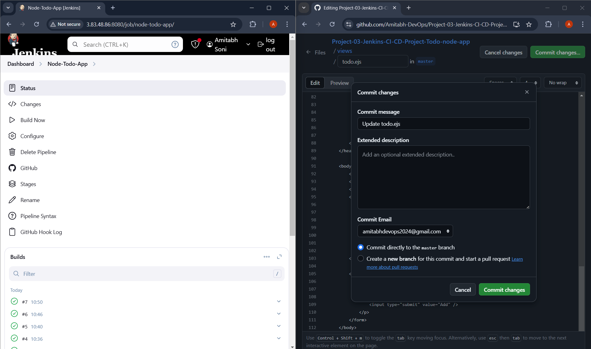
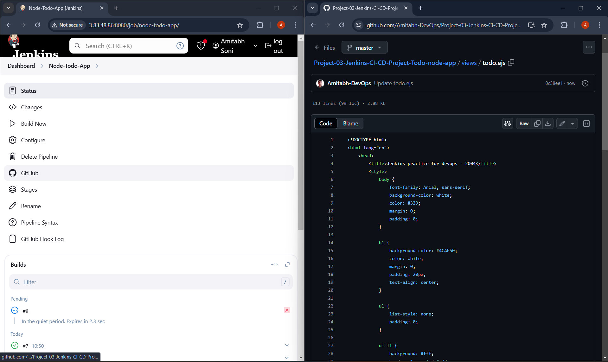
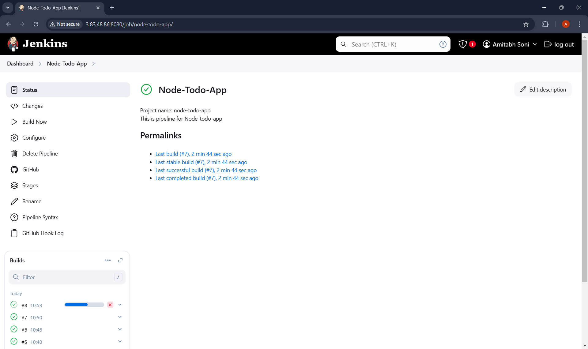
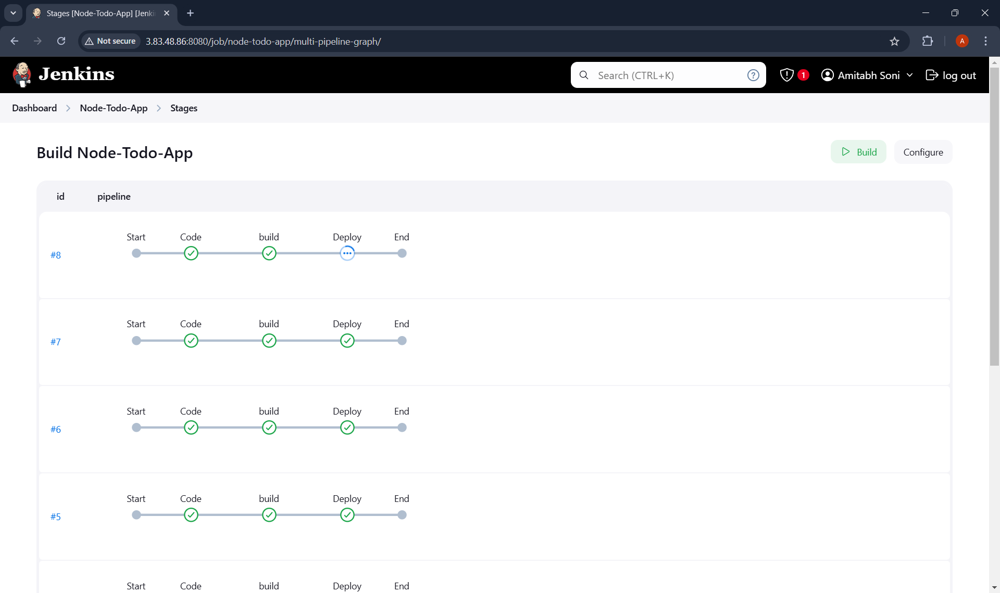
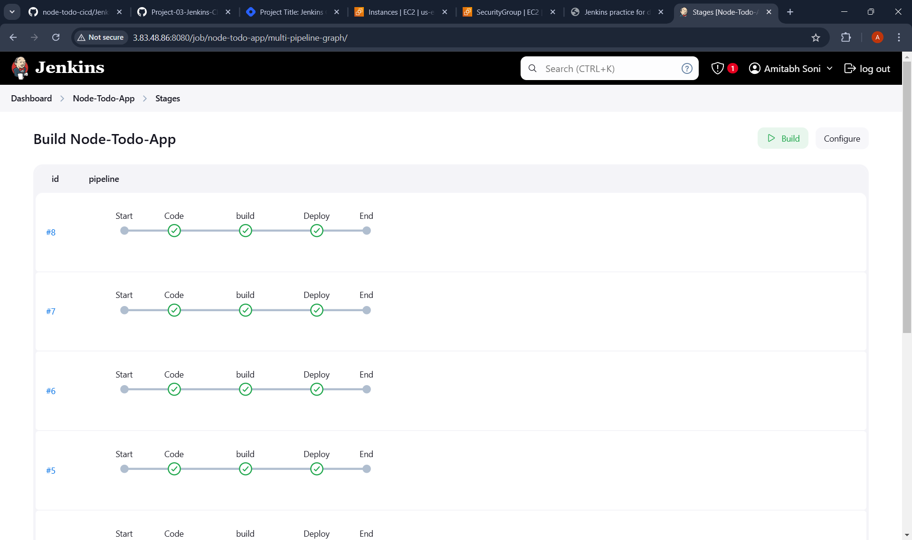
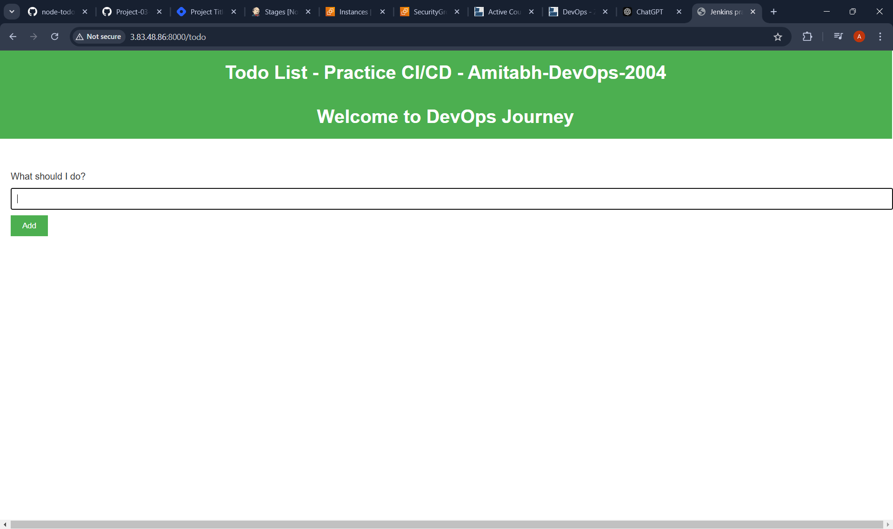
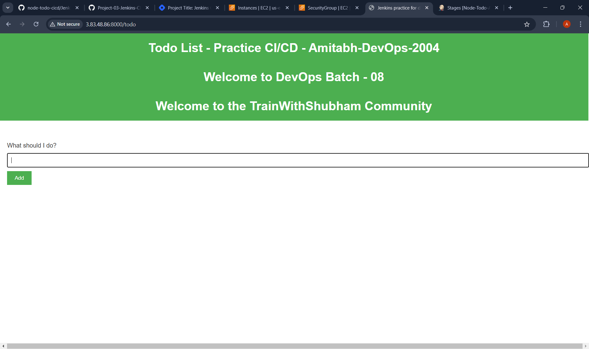
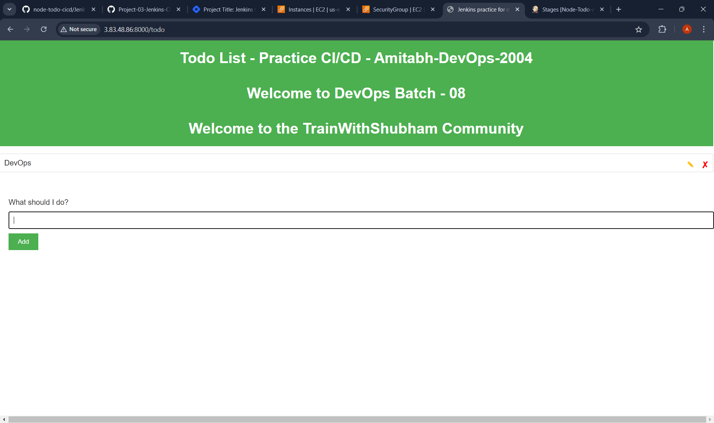
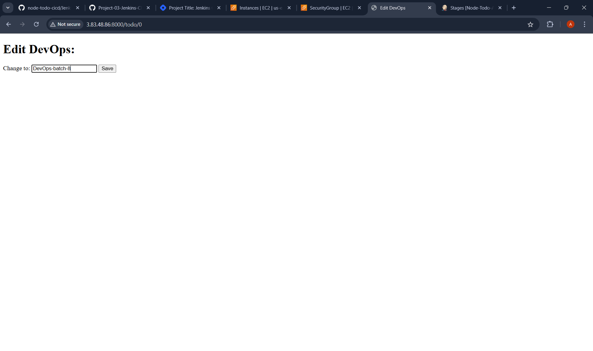
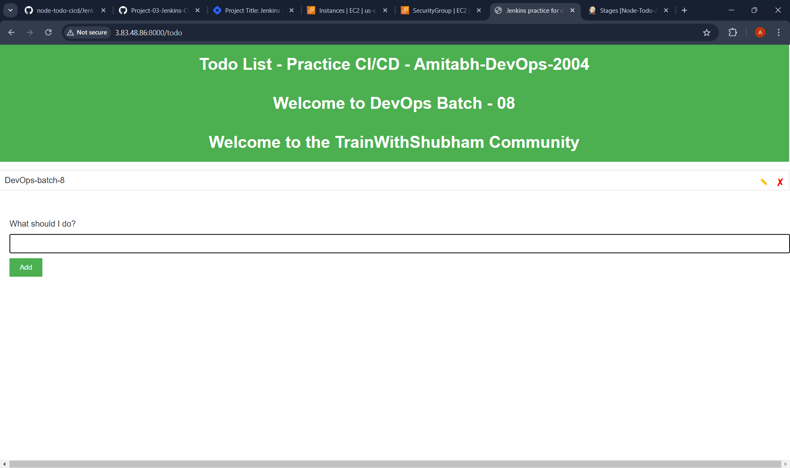

# Step-by-Step Guide to Implementing CI/CD in Node.js Todo Applications


This documentation provides a comprehensive guide on setting up a **CI/CD pipeline** using **Jenkins** integrated with **GitHub** for continuous integration and deployment of a **Node.js To-Do application** on an **AWS EC2** instance. Jenkins will automatically pull code from GitHub, build it, and deploy it using **Docker**.

**Repository Used in This Project:**

* [GitHub Repository - Node.js To-Do App](https://github.com/Amitabh-DevOps/Jenkins-CI-CD-Project-Todo-node-app)
    

By following below steps, you can successfully complete the project!

---

## **Steps to Complete the Project:**

### **1\. Login to AWS and Create an EC2 Instance**

* **Login to your AWS account** through the [AWS Console](https://aws.amazon.com/console/).
    
* **Launch an EC2 instance**:
    
    * Navigate to the **EC2 Dashboard** and click on **Launch Instance**.
        
    * Choose **Ubuntu 24.04 LTS** as the operating system.
        
    * Select the **t2.micro** instance type (free-tier eligible).
        
    * Configure your **security groups** to allow **SSH (port 22)** access and also prepare ports **8080** (for Jenkins) and **8000** (for the web app).
        
    * Launch the instance and download the **.pem key** file for SSH access.
        

### **2\. Connect to the EC2 Instance**

Connect to your newly created EC2 instance using **SSH**.

```bash
ssh -i <your-key-file.pem> ubuntu@<instance-public-ip>
```

### **3\. Update the Instance**

Run the following command to update the instance with the latest package information:

```bash
sudo apt update
```

### **4\. Install Java**

Since Jenkins is built in **Java**, it requires **Java** to run. Install **OpenJDK 17**:

```bash
sudo apt install openjdk-17-jre
```

Verify the installation:

```bash
java -version
```

### **5\. Install Jenkins**

Now, let's install **Jenkins**, which is essential for building the CI/CD pipeline.

a) Install dependencies required for Jenkins:

```bash
sudo apt-get install -y ca-certificates curl gnupg
```

b) Add the Jenkins GPG key:

```bash
curl -fsSL https://pkg.jenkins.io/debian/jenkins.io-2023.key | sudo tee /usr/share/keyrings/jenkins-keyring.asc > /dev/null
```

c) Add Jenkins repository:

```bash
echo deb [signed-by=/usr/share/keyrings/jenkins-keyring.asc] https://pkg.jenkins.io/debian binary/ | sudo tee /etc/apt/sources.list.d/jenkins.list > /dev/null
```

d) Update the package list:

```bash
sudo apt-get update
```

e) Install Jenkins:

```bash
sudo apt-get install jenkins
```

f) Enable Jenkins to start on boot:

```bash
sudo systemctl enable jenkins
```

g) Start Jenkins if your jenkins is not running :

```bash
sudo systemctl start jenkins
```

h) Check Jenkins status to confirm it's running:

```bash
sudo systemctl status jenkins
```

### **6\. Open Jenkins in a Browser**

Jenkins runs on **port 8080**. To access it:

* **Modify the security group** of your EC2 instance to allow inbound traffic on **port 8080**.
    
* In your browser, go to `http://<instance-public-ip>:8080`.
    

### **7\. Unlock Jenkins**

When accessing Jenkins for the first time, you'll be asked for an admin password.

* Retrieve the initial admin password by running:
    

```bash
sudo cat /var/lib/jenkins/secrets/initialAdminPassword
```

* Copy the password and paste it into the Jenkins login screen.
    

### **8\. Install Suggested Jenkins Plugins**

After entering the admin password, Jenkins will prompt you to install plugins. Select **Install Suggested Plugins** to get essential tools.

### **9\. Create an Admin User**

After plugins installation, Jenkins will prompt you to create your admin user account. Set a username and password for future logins.

### **10\. Create a New Jenkins Project**

Now, we'll create a **freestyle project** for our CI/CD pipeline.

* Click on **New Item**.
    
* Enter a name for your project (e.g., **NodeJS To-Do App**).
    
* Select **Pipeline Project** and click **OK**.
    

### **11\. Configure GitHub Integration**

In the new Jenkins project:

* Under **Source Code Management**, select **Git**.
    
* Paste the **URL of your GitHub repository** where your Node.js To-Do application code is hosted.
    

### **12\. Configure Build Trigger for GitHub Webhook**

To ensure Jenkins automatically pulls new code when changes are made on GitHub:

* Go to **Build Triggers** and check **GitHub hook trigger for GITScm polling**.
    

### **13\. Paste below Pipeline script in Pipeline code in Groovy format :**

```plaintext
pipeline {
    agent any
    
    stages {
        
        stage("code"){
            steps{
                git url: "https://github.com/Amitabh-DevOps/Jenkins-CI-CD-Project-Todo-node-app.git", branch: "master"
                echo 'Bhaiya code clone hogaya'
            }
        }
        stage("build and test"){
            steps{
                sh "docker build -t node-app ."
                echo 'Code build done'
            }
        }
        stage("deploy"){
            steps{
                sh "docker-compose down && docker-compose up -d --build"
                echo 'Deployment also done'
            }
        }
    }
}
```

Now, Click on save and go to terminal .

### **14\. Install Docker on EC2 Instance**

Since we will deploy the Node.js app inside a Docker container, Docker needs to be installed on your EC2 instance.

* Install Docker:
    

```bash
sudo apt install docker.io
```

* Add Jenkins to the **docker** group:
    

```bash
sudo usermod -aG docker jenkins
```

* Restart Jenkins to apply changes:
    

```bash
sudo systemctl restart jenkins
```

### **15\. Configure GitHub Webhook**

GitHub needs to notify Jenkins whenever new code is pushed.

* Go to your GitHub repository settings and click on **Webhooks**.
    
* Add a new webhook with the following details:
    
    * **Payload URL**: `http://<instance-public-ip>:8080/github-webhook/`
        
    * **Content Type**: `application/json`
        
* Save the webhook and ensure it shows a green tick, indicating success.
    

### **16\. Open Application Port 8000**

To allow access to your deployed Node.js application:

* Modify the security group of your EC2 instance to allow inbound traffic on **port 8000**.
    

### **17\. Access the Application**

You can now access the deployed Node.js To-Do application by navigating to:

```bash
http://<instance-public-ip>:8000
```

### **18\. Continuous Integration and Deployment**

Every time you push code changes to your GitHub repository, Jenkins will:

1. Automatically pull the latest changes.
    
2. Build a new Docker image.
    
3. Remove any old containers.
    
4. Deploy the updated application.
    

This ensures continuous integration and continuous deployment of your application.

---

## **Conclusion**

This Jenkins CI/CD pipeline automates the entire process of **building**, **testing**, and **deploying** your Node.js application on **AWS EC2** using **Docker**. With the integration of **GitHub webhooks**, any push to your GitHub repository will trigger Jenkins to update your live application seamlessly.

---


# <mark>Output of My Project :</mark>

1 ) Making changes in Github repo :



2 ) Checking the Contineous Integration of code on Jenkins :







3 ) Changes is Successfully applied to Project using Github push :



4 ) Checking the Output :

* Previous output:
    
    
    
* After updating application code :
    
    
    

5 ) Testing the Deployed Project by checking its Features :








6 ) Also Checked Contineous Integration is Working or NOT :

